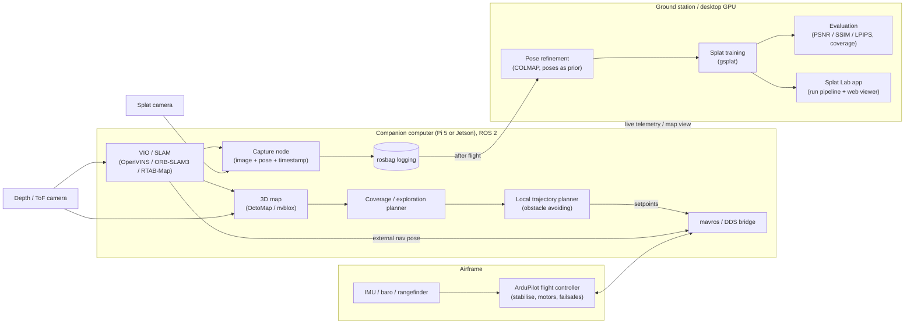

# Autonomous Gaussian Splatting Drone: Project Brief (DRAFT v0.1)

Status: early concept. Everything here is a proposal to argue about. Open questions are at the end.

## 1. Idea in one paragraph

An ArduPilot quadcopter with a ROS 2 companion computer that autonomously flies through a single room, choosing where to go next so the space is covered, while capturing images and poses. Afterwards, the data is turned into a Gaussian splat and viewed in a web viewer. We measure how good the splat is and compare autonomous scans against manual and naive-pattern scans.

**Goal:** experience and CV material in drones, robotics, state estimation, planning and 3D reconstruction. Not a product.

## 2. Prior work (so we know what's new)

Autonomous drone + Gaussian splatting is an active research area (FlyGS, DRAGON, DroneSplat, next-best-view papers). We are not claiming novelty in the field. Our angle is a **low-cost, open, reproducible indoor system with a proper evaluation**, built on ROS 2 and ArduPilot.

## 3. Scope

**In scope (target):** one room, GPS-denied, autonomous coverage flight, offline splat training, web viewer, quantitative evaluation.

**Stretch:** quality-driven next-best-view planning; a second, larger space.

**Out of scope:** real-time splatting on the drone, multi-room or whole-building scans, outdoor GPS flights beyond basic testing, commercial concerns.

## 4. System architecture

Key decisions:

- **ArduPilot handles flight.** The companion sends setpoints and external-nav pose over MAVLink or DDS. If ROS crashes, ArduPilot's failsafes still work.
- **Splat training is offline.** The drone only records images, poses and timestamps to a rosbag.
- **Two cameras:** a depth/ToF camera for SLAM, mapping and avoidance; a separate fast-shutter camera for splat images (motion blur is the main enemy).
- **Everything is replayable.** Rosbags let us rerun SLAM, planning and reconstruction without flying.
- **Simulation first:** ArduPilot SITL + Gazebo + the same ROS 2 nodes.
- **VIO feeds two consumers differently.** Real-time pose goes to ArduPilot's EKF3 over MAVLink purely to hold position/attitude in flight. The capture node logs VIO's pose directly on the companion computer (not round-tripped through the FC) for splat reconstruction — avoids MAVLink latency, EKF3 filtering/mixing, and rate quantization contaminating the training data.

## 5. Work split

| Stream | Owner | Contents |
|---|---|---|
| A. Platform and flight | Niall | Airframe build and vibration tuning, ArduPilot config, MAVLink/DDS bridge, VIO/SLAM integration into ArduPilot, failsafes, flight testing |
| B. Capture and reconstruction | Friend | Camera selection and mount (CAD), capture node and synchronisation, pose refinement, splat training pipeline, evaluation metrics, web viewer and UI |
| C. Autonomy (shared) | Both | Simulation environment, 3D mapping, coverage/exploration planner, trajectory planning, integration |

Stream B needs no drone to start (handheld and simulated scans). Stream C starts in simulation. Stream A is the critical path for hardware.

## 6. Milestones (each one is a CV-able deliverable)

| # | Milestone | Owner | Demonstrable output |
|---|---|---|---|
| M1 | Splat pipeline, no drone | B | Handheld scan to splat in the web viewer, plus notes on capture quality |
| M2 | Simulation + ROS 2 workspace | C | Simulated drone flying waypoints in Gazebo via ROS 2; simulated room scan |
| M3 | Hardware bring-up | A | Airframe flies stably, companion computer connected, telemetry and rosbag logging |
| M4 | GPS-denied hold | A | VIO feeding ArduPilot, stable indoor loiter (fixes the Droneye failure mode) |
| M5 | Manual-flight capture | A+B | Drone-captured images with poses producing a splat |
| M6 | Scripted autonomous scan | C | Pre-planned pattern over one room, end to end, no manual input |
| M7 | Adaptive coverage planner | C | Frontier/coverage exploration with obstacle avoidance, driven by the 3D map |
| M8 | Evaluation and write-up | All | Autonomous vs manual vs lawnmower: coverage and PSNR/SSIM/LPIPS on held-out views; short report and video |
| Stretch | Quality-driven next-best-view | C | Planner uses splat/coverage uncertainty to pick views |

If we stop after M6, we still have a complete result.

M1's detailed plan lives in `gaussian-scanning/BRIEF.md`; the app that runs that pipeline and views the results (Splat Lab, built) is in `gaussian-scanning/app/BRIEF.md`.

## 7. Risks

| Risk | Mitigation |
|---|---|
| Vibration and mass imbalance (as in Droneye) | Balanced frame, soft-mounted FC and camera, tune before adding software |
| Indoor SLAM fails on blank walls or low light | Depth-based odometry as backup; add light and texture to the test room; rosbag replays |
| Motion blur ruins splats | Fast shutter camera, handheld camera tests before flight, slow the flight speed |
| Companion computer too slow | Pi 5 or Jetson; offload heavy processing to the ground station over Wi-Fi if needed |
| Crashes and cost | Simulation first, prop guards, net, kill switch, spare parts budget |
| Scope creep | Fixed scope: one room; M6 is the "done" line |
| VIO pose uses wrong frame convention (ROS ENU vs MAVLink/ArduPilot NED) or an uncalibrated sensor-to-IMU offset | Explicit, tested frame conversion in the MAVLink bridge; measure and configure the extrinsic offset before first flight |
| Companion computer can't sustain real-time VIO at low, *consistent* latency (jitter breaks EKF3 fusion more than average delay does) | Benchmark VIO throughput/jitter on the actual hardware at M3/M4, before relying on it; fall back to Jetson if the Pi can't hold a steady rate |
| FC and companion computer clocks drift apart, misdating vision measurements fed to EKF3 | Use MAVLink timesync (or equivalent) and verify on the bench before trusting external nav in flight |

Outdoor tests with a camera drone over 100g need a CAA Operator ID. Check current rules before any outdoor flight.

## 8. Rough hardware list (to be costed)

Flight controller (we have ArduPilot experience), frame, motors and ESCs, battery; Pi 5 or Jetson Orin Nano; depth/ToF camera; fast-shutter splat camera; optical flow and rangefinder as a backup (from Droneye); safety net and props guards; desktop GPU for training (whatever we have access to).

## 9. Open questions for us to decide

1. **Companion computer:** Pi 5 (cheaper, weaker) or Jetson Orin Nano (more capable, more expensive, heavier)? Do we already own either?
2. **Which SLAM/VIO stack?** Pick after checking which runs well on the chosen hardware.
3. **Depth camera:** which one, given weight and ROS 2 driver support?
4. **Splat camera:** action-cam module, Pi HQ camera or something else? Rolling vs global shutter?
5. ~~**Splat framework:** nerfstudio vs standalone gsplat? What GPU do we have for training?~~ **Decided:** COLMAP 4 + gsplat directly; trains on an RTX 4070 Ti Super (16 GB). See `gaussian-scanning/BRIEF.md`.
6. **Test space:** where can we legally and safely fly indoors, and how big is it?
7. **Time and budget:** how many hours per week each, what deadline, and what can we spend?
8. **Is the friend's stream big enough?** Should the viewer/UI include anything more interesting, such as an annotated scan, before/after comparison or coverage heatmap?
9. **Ground rover fallback:** do we want one as a backup if the drone slips?
10. **Do we still want this project,** or one of the alternatives we were discussing?
