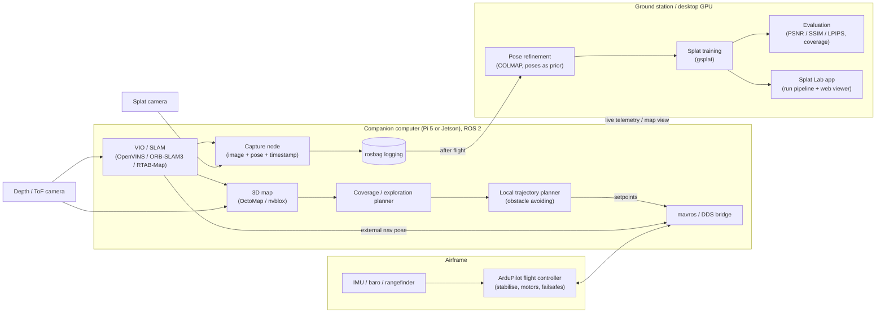

# Autonomous Gaussian Splatting Drone: Project Brief (DRAFT v0.3)

Status: the drone side is still a proposal to argue about. **M1 (splat pipeline, no drone) is built**: see section 6a, and [`README.md`](README.md) to run it. Open questions are at the end.

## 1. The idea

An ArduPilot quadcopter with a ROS 2 companion computer flies itself through a single room, choosing where to go next so the whole space gets covered, and records images and camera positions as it goes. Afterwards, that footage is turned into a Gaussian splat (a photorealistic 3D scene) and viewed in a web viewer. We measure how good the splat is and compare autonomous scans with manual and simple-pattern scans.

**Goal:** experience and CV material in drones, robotics, state estimation, planning and 3D reconstruction. Not a product.

## 2. Prior work

Autonomous drones for Gaussian splatting are an active research area (FlyGS, DRAGON, DroneSplat, next-best-view papers), so we're not claiming novelty. Our angle is a **low-cost, open, reproducible indoor system with a proper evaluation**, built on ROS 2 and ArduPilot.

## 3. Scope

- **In:** one room, no GPS, autonomous coverage flight, splat training after the flight, web viewer, quantitative evaluation.
- **Stretch:** planning views by expected splat quality; a second, larger space.
- **Out:** splatting live on the drone, multi-room or whole-building scans, outdoor GPS flights beyond basic testing, commercial concerns.

## 4. System architecture

Key decisions:

- **ArduPilot flies the drone.** The companion computer only sends it target positions and its own position estimate. If ROS crashes, ArduPilot's failsafes still work.
- **Splats are trained after the flight**, on the desktop GPU. The drone just records images, positions and timestamps to a rosbag.
- **Two cameras:** a depth camera for positioning, mapping and obstacle avoidance, and a separate fast-shutter camera for the splat images (motion blur ruins splats).
- **Everything is replayable.** From a rosbag we can rerun positioning, planning and reconstruction without flying again.
- **Simulation first:** ArduPilot SITL + Gazebo, running the same ROS 2 nodes as the real drone.
- **The position estimate (VIO) goes two ways.** ArduPilot gets it in real time to hold the drone steady. The capture node logs it directly on the companion computer, so the splat data isn't degraded by the flight controller's latency and filtering.

## 5. Work split

| Stream | Owner | Contents |
|---|---|---|
| A. Platform and flight | Niall | Airframe build and vibration tuning, ArduPilot config, MAVLink/DDS bridge, VIO/SLAM into ArduPilot, failsafes, flight testing |
| B. Capture and reconstruction | Friend | Splat camera and mount (CAD), capture node and syncing, pose refinement, splat pipeline, evaluation metrics, web viewer and UI |
| C. Autonomy (shared) | Both | Simulation, 3D mapping, coverage/exploration planner, trajectory planning, integration |

Stream B can start without a drone (handheld and simulated scans), and stream C starts in simulation. Stream A is the critical path for hardware.

## 6. Milestones (each one a CV-able deliverable)

| # | Milestone | Owner | What we can show |
|---|---|---|---|
| M1 | Splat pipeline, no drone | B | Handheld scan to splat in the web viewer, plus notes on capture quality. **Built; see 6a** |
| M2 | Simulation + ROS 2 workspace | C | Simulated drone flying waypoints in Gazebo; simulated room scan |
| M3 | Hardware bring-up | A | Airframe flies stably, companion computer connected, telemetry and rosbag logging |
| M4 | Indoor hover without GPS | A | VIO feeding ArduPilot, stable indoor hover (fixes the Droneye failure) |
| M5 | Manual-flight capture | A+B | Splat made from images and positions the drone recorded |
| M6 | Scripted autonomous scan | C | Pre-planned pattern over one room, end to end, no manual input |
| M7 | Adaptive coverage planner | C | Drone explores the room on its own, avoiding obstacles, using its 3D map |
| M8 | Evaluation and write-up | All | Autonomous vs manual vs lawnmower pattern: coverage and image-quality scores on held-out views; short report and video |
| Stretch | Quality-driven view planning | C | Planner picks views where the splat is weakest |

If we stop after M6, we still have a complete result.

## 6a. Where we are: M1

**Built:** Splat Lab, a local web app that turns a video or a set of photos into a splat and shows it in the browser. Video → the sharpest frames → COLMAP works out where each frame was taken from → gsplat trains the splat → the app's viewer shows it with the camera path, a side-by-side with the original photos, and a top-down view. It runs as a background service on the RTX 4070 Ti Super and is shared with the other person over Tailscale. How to run it: [`README.md`](README.md). Design: [pipeline brief](gaussian-scanning/BRIEF.md), [app brief](gaussian-scanning/app/BRIEF.md).

**Results so far.** Quality is measured as PSNR on frames held back from training: how closely the splat reproduces views it hasn't seen. Higher is better; around 30 dB looks good.

- **Public test scene** (Mip-NeRF 360 "room"): 30.7 dB in about 3 minutes, 32.1 dB at full quality, in line with published results.
- **Our first phone videos of a room** (2026-09-29) came out garbled. This was mostly a software problem: COLMAP's fast "global" mapper got the camera positions wrong on handheld footage while reporting success. Switching to the slower "incremental" mapper and taking more frames per second fixed most of it (18.9 → 24.2 dB on one video, 19.6 → 22.9 dB on the other). The app now warns when footage is blurry or the camera positions look wrong. Details: [pipeline brief, section 3a](gaussian-scanning/BRIEF.md).

**Still to do for M1:** more real scans (other rooms, and a slow walk-around following the new filming advice) and a short write-up of which capture technique works. This feeds into choosing the splat camera (question 4) and the flight speed. The early lesson for the drone: move slowly and steadily, travel through the room rather than rotating on the spot, and be careful near windows.

**Needed later from the app** (designed, not built):
- **M5:** importing the drone's rosbag, using its recorded positions as a starting point for COLMAP.
- **Real-world scale** (metres), for measurements and the coverage metric.
- **M8:** one shared test capture per room, so every scan strategy is scored on the same views. Today each run is scored on its own held-out frames, which can't compare strategies fairly.

## 7. Risks

| Risk | Mitigation |
|---|---|
| Vibration and mass imbalance (as in Droneye) | Balanced frame, soft-mounted flight controller and camera; tune before adding software |
| Positioning fails on blank walls or in low light | Depth-based odometry as backup; add light and texture to the test room; rosbag replays |
| Motion blur ruins splats (confirmed on the first handheld scans) | Fast-shutter camera, handheld tests before flying, slow flight |
| COLMAP gets camera positions wrong when the camera rotates on the spot or looks out of a window (seen on the first handheld scans) | Plan flight paths that travel rather than spin in place; use the drone's recorded positions as priors (M5); the app now flags suspect positions |
| Companion computer too slow | Pi 5 or Jetson; offload heavy work to the ground station over Wi-Fi if needed |
| Crashes and cost | Simulation first, prop guards, net, kill switch, spare-parts budget |
| Scope creep | One room; M6 is the "done" line |
| Coordinate-frame mix-ups (ROS uses ENU, ArduPilot NED) or an unmeasured camera-to-IMU offset | Explicit, tested frame conversion in the bridge; measure and configure the offset before the first flight |
| VIO can't run with low, *steady* latency on the companion computer (jitter hurts more than average delay) | Benchmark it on the real hardware at M3/M4 before relying on it; move to a Jetson if the Pi can't keep up |
| Flight controller and companion computer clocks drift apart | MAVLink timesync, checked on the bench before trusting VIO in flight |

Outdoor flights with a camera drone over 100 g need a CAA Operator ID. Check the current rules before flying outdoors.

## 8. Rough hardware list (to be costed)

Flight controller (we have ArduPilot experience), frame, motors and ESCs, battery; Pi 5 or Jetson Orin Nano; depth/ToF camera; fast-shutter splat camera; optical flow and rangefinder as a backup (from Droneye); safety net and prop guards. Training GPU: have (RTX 4070 Ti Super, 16 GB).

## 9. Open questions

1. **Companion computer:** Pi 5 (cheaper, weaker) or Jetson Orin Nano (more capable, pricier, heavier)? Do we already own either?
2. **Positioning (SLAM/VIO) stack:** pick after checking which runs well on the chosen hardware.
3. **Depth camera:** which one, given weight and ROS 2 driver support?
4. **Splat camera:** action-cam module, Pi HQ camera or something else? Rolling or global shutter?
5. **Test space:** where can we legally and safely fly indoors, and how big is it?
6. **Time and budget:** hours per week each, deadline, and spend?
7. **Is the friend's stream big enough?** Built so far: capture-path overlay, photo comparison, top-down view. Still open: a coverage heatmap and side-by-side run comparison (both come with M8).
8. **Ground rover fallback** in case the drone slips?
9. **Do we still want this project,** or one of the alternatives we discussed?

Decided: splat framework is COLMAP 4 + gsplat (not nerfstudio), trained on the RTX 4070 Ti Super; see the [pipeline brief](gaussian-scanning/BRIEF.md).
